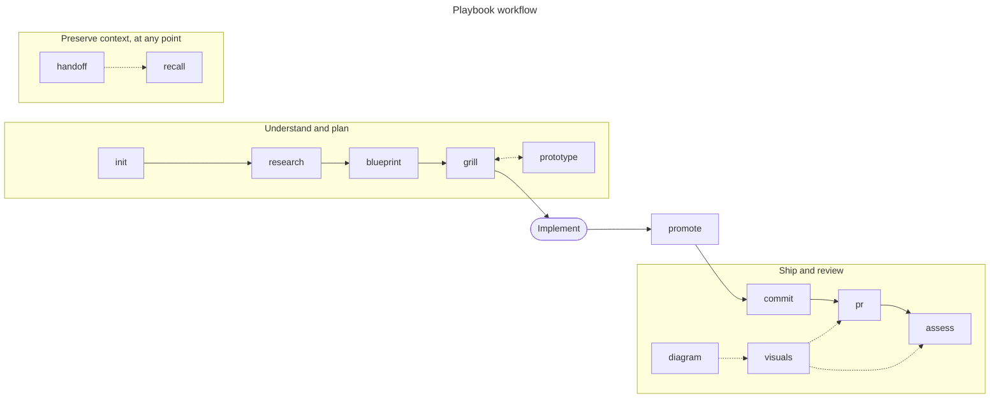

# Playbook

Personal engineering commands for planning, building, reviewing, and shipping software with AI coding agents.

Playbook is an opinionated collection of reusable engineering workflows. Each command is packaged as an [Agent Skill](https://agentskills.io): one canonical `SKILL.md` that works unchanged in Claude Code, Codex, OpenCode, Pi, OMP, and any other agent that implements the standard. There are no per-agent prompt files, loaders, or installers to keep in sync.

## Install

Skills are instructions that run with your agent's permissions. Read them before installing.

Installation uses the [`skills`](https://github.com/vercel-labs/skills) CLI, which needs Node.js 18 or newer:

```bash
npx skills add dominionism/Playbook --global
```

The installer detects the agents on your machine and lets you choose targets. To install non-interactively for the agents Playbook is verified against:

```bash
npx skills add dominionism/Playbook \
  --global \
  --agent claude-code codex opencode pi \
  --yes
```

Where the skills land:

- `~/.agents/skills/<name>` holds the canonical copy. Codex, OpenCode, OMP, and Pi read this directory directly.
- Claude Code and Pi also receive a symlink in their own skill directories (`~/.claude/skills`, `~/.pi/agent/skills`).

OMP needs no target of its own: it reads `~/.agents/skills` as well as the Claude Code and Codex skill directories.

List the skills without installing, or install a subset:

```bash
npx skills add dominionism/Playbook --list
npx skills add dominionism/Playbook --global --skill research blueprint commit
```

Update or remove with the same CLI:

```bash
npx skills update --global
npx skills remove --global
```

## Invoke

The skill format is portable; the invocation syntax belongs to each host.

| Host | Invocation |
| --- | --- |
| Claude Code | `/blueprint` |
| Codex | `$blueprint` |
| Pi | `/skill:blueprint` |
| OMP | `/skill:blueprint` |
| OpenCode | Ask for the `blueprint` skill; OpenCode loads it through its `skill` tool |

Every description states when the command applies, so agents that select skills on their own pick them up at the right moment. Commands with side effects carry explicit approval gates in their workflows.

## Commands

### Understand and plan

| Command | Purpose |
| --- | --- |
| `init` | Create Playbook's non-destructive `Context/` and `Memories/` project structure |
| `research` | Map a codebase or feature deeply enough to work in it confidently |
| `blueprint` | Produce a concrete implementation plan grounded in repository context |
| `grill` | Challenge a plan one decision at a time and sharpen project language |
| `prototype` | Build disposable code to answer a high-fidelity engineering question |

### Preserve context

| Command | Purpose |
| --- | --- |
| `handoff` | Capture the current session's signal and exact next action |
| `recall` | Reconstruct durable context, verify state, and resume work |
| `promote` | Reconcile implementation learnings into plans, research, glossary, and ADRs |
| `record` | Save a concept in a configurable personal engineering knowledge library |
| `locate` | Find and absorb a context tree through the optional Grove CLI |
| `consolidate` | Distill a session into Grove with diff review and explicit acceptance |

### Ship and review

| Command | Purpose |
| --- | --- |
| `commit` | Create atomic Conventional Commits from the actual diff |
| `pr` | Open or update a GitHub PR with a synthesized reviewer-facing narrative |
| `assess` | Review a GitHub PR against its actual code and produce a gated verdict |
| `visuals` | Produce Story, Delta, and review Focus visuals for a change |
| `diagram` | Generate accurate, accessible Mermaid diagrams from codebase analysis |

## Workflow

The commands form one loop. `init` runs once per project. `research`, `blueprint`, and `grill` build the plan, and `prototype` answers the questions a plan cannot settle on paper. After implementation, `promote` folds what was learned back into the plan, glossary, ADRs, and research notes. `commit`, `pr`, and `assess` ship and review the work, with `visuals` and `diagram` supplying the pictures. `handoff` and `recall` pause and resume a session at any point in the loop.



`record`, `locate`, and `consolidate` sit outside the loop. `record` files a concept in a personal knowledge library, and the two Grove commands move context between sessions through a separate memory system.

## Project context model

Several commands share an opinionated repository-local context structure:

```text
Context/
├── ADR/
├── Plans/
├── Research/
│   └── Research.md
└── Glossary.md
Memories/
```

Run `init` once to create the missing scaffolding without overwriting existing files. `research`, `blueprint`, `grill`, and `promote` maintain the durable context; `handoff` and `recall` preserve session continuity.

## Requirements

- Node.js 18 or newer for the installer.
- Git for the repository and continuity commands.
- `pr` and `assess` require an authenticated [GitHub CLI](https://cli.github.com/) session with access to the target repository.
- Inline diagrams require a Mermaid-compatible Markdown renderer. Local SVG or PNG rendering additionally requires `mmdc`.
- Commands contain POSIX-shell examples and are designed for macOS and Linux environments.

### Record destination

`record` resolves its library root in this order:

1. `PLAYBOOK_LIBRARY_DIR`, when set.
2. An existing `~/Developer/The Architect/` directory, for backward compatibility.
3. A location chosen and approved by the user.

It never creates an unconfigured library silently.

### Grove integration

`locate` and `consolidate` bundle their complete protocols but depend on the separate `grove` CLI and a Grove root (`GROVE_ROOT`, defaulting to `~/Grove`). Both check for Grove before doing anything else and stop with a clear message when it is missing. Grove is not yet public; the other fourteen commands do not use it.

## Develop Playbook

Clone, install from the checkout, then link the checkout so that edits are live in every agent:

```bash
git clone https://github.com/dominionism/Playbook.git
cd Playbook
npx skills add . --global --yes
sh scripts/link.sh
```

`npx skills add .` copies each skill into `~/.agents/skills` and wires the agents. `scripts/link.sh` then replaces those copies with symlinks to `skills/<name>` in the checkout, so a saved edit is what every agent reads next. Re-run `npx skills add . --global --yes` to return to copies.

Validate before committing:

```bash
npm test
for skill in skills/*/; do uvx --from skills-ref agentskills validate "$skill"; done
```

`npm test` checks the frontmatter, the skill layout, bundled references, and that the command tables above match `skills/`. The second command runs the reference validator from agentskills.io.

### Structure

Every command follows the open Agent Skills layout:

```text
skills/
└── command-name/
    ├── SKILL.md
    ├── references/   # optional
    ├── scripts/      # optional
    └── assets/       # optional
```

`SKILL.md` is the canonical implementation. Playbook keeps no duplicated per-agent prompt files or loaders.

## License

[MIT](LICENSE)
