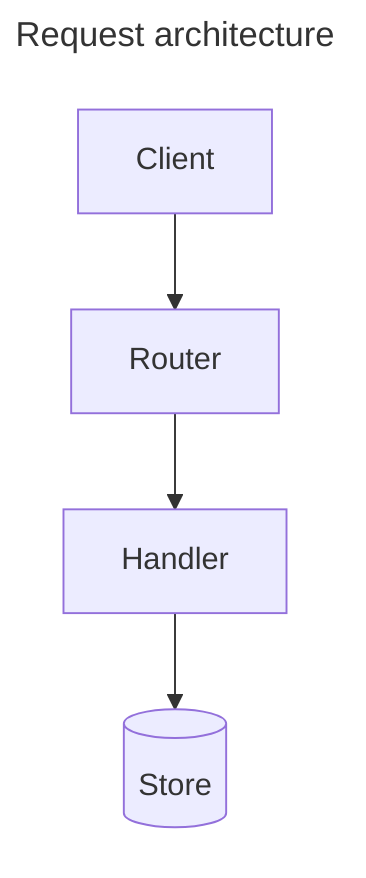

Produce Mermaid.js diagrams that make codebase structure, architecture changes, and system interactions visible at a glance. A diagram earns its place when a reviewer parses a picture faster than prose — no decoration, no surplus.

The diagram definition is Mermaid syntax inside a ` ```mermaid ` fenced code block. GitHub renders these natively in PR descriptions, issues, READMEs, and any markdown file. No CLI tool needed for inline rendering.

---

## 1. Scope

Determine what to visualize. The user said: "$ARGUMENTS". If not specified, and the command was called from `/pr`, derive the scope from the diff range (see §7). If neither applies, ask: "What would you like me to diagram?"

Arguments (freeform after `/diagram`):

- **A path** — file, directory, or module to analyze
- **A git range** — `HEAD~5..HEAD`, `main..feature`
- **A diagram type** — `flowchart`, `classDiagram`, `gitGraph`, `sequenceDiagram`, `stateDiagram-v2`, or `auto`
- **A description** — "the auth middleware chain", "how the payment pipeline works"

Combine them: `/diagram flowchart src/routes/` — "flowchart of the route dependency graph."
No arguments: `/diagram` — detect scope from context. If none exists (not in a PR, no obvious target), ask.

## 2. Diagram types and when to use them

| Type | Use Case | Example |
|---|---|---|
| `flowchart TD/LR` | Architecture overviews, data flow, module dependencies, CI/CD pipelines | `A[Client] --> B[Router] --> C[Handler]` |
| `classDiagram` | Type/interface hierarchies, inheritance, composition | `Vehicle <|-- Car`, `Store *-- Product` |
| `gitGraph` | PR branch/commit strategy, release histories | `commit id:"abc123"`, `branch feature-x`, `checkout feature-x` |
| `sequenceDiagram` | API request flows, middleware chains, async message passing | `Client->>+Server: GET /api/orders` |
| `stateDiagram-v2` | State machines, workflow states, reducer transitions | `pending --> approved: authorize` |
| `block-beta` | Codebase layout, directory structure, container diagrams | `block "src"` → sub-blocks |

Default: `flowchart TD` if no type is specified (covers most PR-architecture visuals). Use `auto` when the agent should pick the best type for the target.

## 3. Conventions

### General
- **Node IDs**: short, uppercase identifiers. Labels in brackets.
  - Rectangle: `A[Client App]`
  - Rounded: `A(Process Request)`
  - Circle: `A((Auth))`
  - Diamond: `A{Valid?}`
  - Database: `A[(PostgreSQL)]`
- **Edges**: `A --> B` for directed flow. `A --- B` for undirected. `A -.-> B` for async/optional. `A == B` for thick/emphasis.
- **Subgraphs**: group related nodes. Give them a label: `subgraph Auth[Auth Layer]`.
- **Comments**: `%% comment text` — use to annotate sections the reader should note but the viewer doesn't render.
- **Labels**: always use `"quoted labels"` around text with special characters, spaces, or punctuation. Avoid unquoted single-word labels unless truly single and ASCII-safe.

### flowchart
- Default orientation `TD` (top-down). Use `LR` only when TD would be unreasonably tall (>30 nodes vertical).
- Group by subsystem or layer using `subgraph`.
- Style key nodes: `style A fill:#bbf,stroke:#66f` for emphasis. Use sparingly — one or two nodes per diagram.

### classDiagram
- `<<Interface>>` for interfaces, `<<Abstract>>` for abstract classes.
- `<|--` for inheritance, `*--` for composition, `o--` for aggregation.
- Show only key properties and methods — not every getter/setter.
- Limit to ~15 classes per diagram. If more exist, show the core set and add `%% 20+ classes omitted for readability`.

### gitGraph
- Use for PR context: show the branch relationship, not every commit.
- `commit id:"abc1234"` with abbreviated SHAs.
- Maximum 2-3 branches per diagram. For complex histories, reference the full `git log` instead.
- Consider whether a gitGraph truly clarifies — for a single-branch PR with 5 linear commits, text suffices.

### sequenceDiagram
- `->>` for synchronous call, `-->>` for async/return.
- `+`/`-` for activate/deactivate on same line: `A->>+B: call()` / `B-->>-A: return`.
- `Note over A,B: explanation` for cross-participant notes.
- Limit to ~8 participants per diagram.

### stateDiagram-v2
- `[*]` for initial/final states.
- `State1 --> State2: trigger` for transitions.
- Group states with `state "Label" as Alias` for complex labels.

## 4. Size and readability rules

- **Maximum 30 nodes per diagram** (GitHub rendering degrades beyond this; also a comprehension ceiling for reviewers).
- **Maximum 50 edges per diagram.**
- **Maximum 8 participants** (sequenceDiagram) / **8 subgraphs** (flowchart).
- If the subject exceeds these limits, split into multiple diagrams — one per subsystem, layer, or concern.
- **Start simple, then layer.** The first diagram in a PR shows the broad architecture; subsequent diagrams zoom into changed subsystems.

Size enforcement is critical — GitHub silently shows raw code for diagrams exceeding internal limits (~50KB definition text, ~500 edges). The agent MUST count nodes and edges and refuse to generate a diagram that exceeds these limits, splitting it instead.

## 5. Accessibility

Every diagram MUST include accessibility metadata as the first lines inside the ` ```mermaid ` block:


Or inline (alternative syntax for diagram types that support it):

```
%%{init: {'flowchart': {'htmlLabels': true}} }%%
```

Specifically:
- **`accTitle: "descriptive title"`** — short, describes what the diagram shows.
- **`accDescr: "one or two sentence description"`** — what the diagram conveys, for screen readers and mobile viewers who can't see the rendered SVG.

Place these inside the Mermaid frontmatter block (the `---` delimited section at the top) so Mermaid renders them as SVG `<title>` and `<desc>` elements with ARIA attributes. GitHub preserves these.

## 6. Output

### Inline mode (default)
Generate a ` ```mermaid ` fenced code block with the diagram definition. Precede it with a plain-text description (1-2 sentences) that explains what the diagram shows. This is the format for PR descriptions and markdown docs — GitHub renders the block natively.

```
The request flows through three layers before reaching storage:



### File mode (`--render local`)
The agent:
1. Writes the Mermaid definition to a `.mmd` file in a temp location.
2. Runs `mmdc` to render SVG/PNG:
   ```bash
   mmdc -i diagram.mmd -o diagram.svg [-t dark] [-b transparent]
   ```
3. Reports the output path and describes the diagram contents.
4. Cleans up the `.mmd` temp file unless `--keep` is specified.

File mode is for local preview, CI artifacts, or non-GitHub platforms. Most of the time, inline mode suffices — GitHub renders the ` ```mermaid ` block natively.

### File mode fallback
If `mmdc` is not installed (`command -v mmdc` fails) and `--render local` was requested, fall back to inline mode and report: "Local rendering requested but mmdc not found. Generating inline Mermaid block instead — rendered by GitHub on push."

## 7. Integration with /pr

When `/diagram` is called from `/pr`, the scope is the PR's diff range. The agent:

1. Reads the full diff (`git diff <base>..HEAD`) to understand what changed.
2. Determines which diagram type(s) best communicate the change's shape:
   - **Architecture/structural changes** (files moved, modules extracted, new subsystem) → `flowchart`
   - **Type/interface changes** → `classDiagram`
   - **History/branching** → `gitGraph`
   - **Data flow changes** → `flowchart` or `sequenceDiagram`
3. Generates the diagram(s). Each diagram must:
   - Be preceded by a plain-text description.
   - Have `accTitle` and `accDescr` for accessibility.
   - Focus on the changed parts, not the entire system.
4. The `/pr` command embeds these inline in the PR description.

### What /pr does with diagrams

The `/pr` command's Visuals section (in `~/.commands/pr.md`) instructs the agent to:

- Generate Mermaid ` ```mermaid ` fenced blocks (not ASCII art).
- Use `/diagram` protocol for the generation logic.
- Keep diagrams focused on the change, not the whole system.
- Add plain-text descriptions above each diagram.

## 8. Rules

- **Diagrams must be accurate.** A misleading diagram is worse than none. If the codebase structure is too complex to represent faithfully within Mermaid's limits, say so and generate text instead.
- **No decorative diagrams.** A visual for a single-file tweak, a format-only change, or a rename is noise. Apply the same bar as `/pr`: a diagram earns its place when a reviewer parses it faster than prose.
- **Size limits are hard.** The agent counts nodes, edges, and nested subgraphs. If the limit would be exceeded, split into multiple diagrams or summarize in text. A diagram that silently fails to render on GitHub is worse than no diagram at all.
- **No tool attribution.** Never add "Generated by AI" or credits anywhere near a diagram. The agent is the author.
- **Labels use project language.** Use terms from `Context/Glossary.md` if it exists. Respect settled vocabulary.
- **Diagrams for the grove.** When called from `/consolidate`, the protocol at `~/Developer/Grove/protocols/consolidate.md` treats diagrams as first-class leaves: "any context-rich file belongs (a diagram, a JSON fixture, a transcript excerpt that *is* the signal)." Diagrams generated for a grove consolidation should be saved as `.mmd` files in the Knowledge/ branch.

## 9. Anti-patterns

- **Auto-generating a diagram for every PR.** Not every change needs a visual. Apply the viewer bar: "Would a reviewer who hasn't seen this branch parse the change faster from a diagram than from text?" If no, skip the diagram.
- **Showcasing the whole system.** The diagram must focus on what changed. A full-architecture diagram with one highlighted path is noise — the reviewer needs to see the delta, not the static.
- **More than 3 diagrams per PR.** Beyond three, the reviewer stops reading them. Pick the most important 1-3 views.
- **Skipping alt-text.** accTitle/accDescr are mandatory. A diagram with no accessibility metadata is incomplete — the agent must include it.
- **Unvalidated Mermaid syntax.** If uncertainty exists about whether a syntax form renders on GitHub (bleeding-edge feature, recently changed behavior), prefer a simpler, well-known form. When in doubt, `flowchart` is the safest type.
- **Using `info` or `gantt` diagrams.** These add no value for codebase visualization. Stick to the types in §2.

## 10. Workflow

**Before this command:** the agent has context on what to visualize — a codebase to map, a PR diff to illustrate, or a discussion to make concrete.

**After this command:**
- If the diagram was for a PR → the agent embeds the ` ```mermaid ` block in the PR description, and `/pr` continues with the rest of the summary.
- If the diagram was standalone → the agent presents the block and waits for further direction.
- If the diagram uncovered a code structure issue or suggestion → the agent flags it before continuing.
- To preserve the session with diagram context → `/handoff` to checkpoint.
